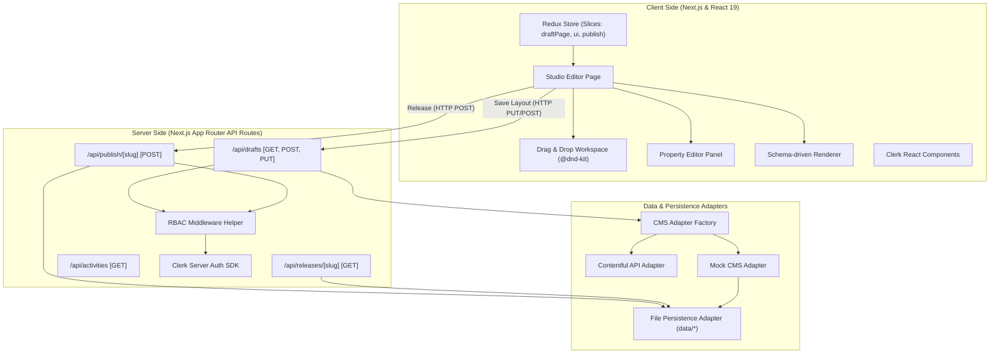

# LaunchPad 🚀

**LaunchPad** is a premium, interactive, drag-and-drop landing page builder studio. Built on the latest web technologies, it allows creators and developers to visually assemble, configure, preview, and publish modular landing pages in minutes. 

---

## 🎨 Key Features

- **Drag-and-Drop Workspace**: Powered by `@dnd-kit`, allowing users to easily reorder and arrange modular landing page sections (Hero, Features, Testimonial, and CTA).
- **Real-Time Property Editor**: Sidebar panel enabling immediate updates of content, text alignment, CTA link targets, and section-specific configurations.
- **Redux-Backed State Synchronizer**: Powered by Redux Toolkit to manage active panels, selection state, workspace drag-and-drop offsets, and publication parameters.
- **Role-Based Access Control (RBAC)**: Secure pages integrated with **Clerk Authentication** and an RBAC Simulator simulating permissions (Viewer, Editor, Publisher).
- **Organization Settings**: Dedicated panel displaying Clerk's `<OrganizationProfile />` to manage membership invitations and role configurations.
- **Dynamic Notifications**: TopBar dropdown notification system displaying activities (creation, edits, and deployments) synced with local browser storage.
- **Schema-Driven Renderer**: Instantly parses and validates section layout arrays using Zod, handling fallback rendering and error boundaries gracefully.
- **Idempotent Publish & SemVer Flow**: Release landing page snapshots using semantic versioning (Major, Minor, Patch) with automated changelog generation.

---

## 🏗️ Architecture Overview

The diagram below outlines the runtime data flow and architectural separation of concerns between client state, server router APIs, and data adapters:



---

## 🛠️ Tech Stack

- **Framework**: [Next.js 16 (App Router)](https://nextjs.org/) & [React 19](https://react.dev/)
- **Styling**: [Tailwind CSS v4](https://tailwindcss.com/) & [Radix UI](https://www.radix-ui.com/)
- **State Management**: [Redux Toolkit](https://redux-toolkit.js.org/)
- **Authentication**: [Clerk Auth](https://clerk.com/)
- **Workspace Drag-and-Drop**: [@dnd-kit](https://dnd-kit.com/)
- **Validation**: [Zod](https://github.com/colinhacks/zod)
- **Testing**: [Playwright E2E](https://playwright.dev/) & [Axe Core](https://github.com/dequelabs/axe-core)
- **CI/CD**: GitHub Actions

---

## 📂 Project Structure

```text
launchpad/
├── .github/workflows/   # CI/CD workflows (caching, lint, typecheck, Playwright tests)
├── data/                # Local file-persistence directory (git-ignored, stores drafts/releases)
├── src/
│   ├── app/             # App Router routes (Dashboard, Studio, Preview, Org, APIs)
│   ├── components/      # UI components (editor workspace, layout topbar, section widgets)
│   ├── hooks/           # Custom React hooks (useIsMobile, etc.)
│   ├── lib/             # Shared state, CMS adapters, auth rules, schemas, and persistence
│   └── proxy.ts         # Clerk middleware proxy rules
├── tests/               # Playwright integration & accessibility tests
├── playwright.config.ts # Playwright test environment config
└── package.json         # Scripts and project dependencies
```

---

## 💾 Redux Slice Responsibilities

The application state is managed centrally by Redux Toolkit, segmented into three slices:

### 1. `draftPage`
Manages the active landing page layout data.
- **State**: Metadata, layout sections list (`PageSection[]`), and `isDirty` unsaved flag.
- **Actions**: Adding, removing, reordering (`reorderSections`), updating property values, and resetting the active draft workspace.

### 2. `ui`
Manages the user interface interaction state.
- **State**: Selected section ID, active editor panel (`sections` selector vs `properties` editor), preview mode toggle, and saving status indicators.
- **Actions**: Switching sidebar panels, selecting sections, toggling viewport preview modes, and managing loading states.

### 3. `publish`
Manages the semantic versioning and release configurations.
- **State**: Active version code, release history list, publish loading status, selected SemVer bump type (`patch`, `minor`, `major`), and release changelog notes.
- **Actions**: Syncing version numbers, updating changelog forms, and appending new releases to the history.

---

## 🔌 Contentful Model & Adapter

### Why an Adapter Pattern?
To decouple the user interface from the underlying Content Management System, we implement an **Adapter Pattern** (`CmsAdapter` interface). This allows the application to remain database-agnostic. 
- During production, it targets the **Contentful API** (`ContentfulAdapter`).
- During local runs or testing without API keys, it falls back to the **Mock Adapter** (`MockAdapter`), which persists data to the local disk.

### Draft vs. Published Mode
- **Drafts**: Modified layouts are saved as mutable drafts. The CMS adapter loads draft entries when requested in preview mode (`preview = true`).
- **Published**: Publishing creates an immutable release snapshot with a version tag. The adapter retrieves published versions directly for live previewing.

---

## 🎨 Schema-driven Renderer

The rendering engine relies on a strict schema-driven approach to guarantee layout integrity:

1. **Zod Validation**: Layout configurations are parsed against Zod schemas on load/save. Invalid section properties trigger warnings instead of crashing the workspace.
2. **Registry Pattern**: The `section-registry.ts` maps section type keys (e.g. `hero`, `features`) to their respective React widgets. Adding a new section only requires registering the component in the registry.
3. **Unsupported Section Fallback**: If a page contains a section type not recognized by the registry, the renderer displays an "Unsupported Section" fallback block indicating the missing type, instead of breaking the render thread.
4. **Error Boundaries**: Component-level React Error Boundaries wrap each registered section to catch runtime errors (e.g., malformed image URLs) and isolate them, allowing the remainder of the page to render.

---

## 🏷️ Publish & SemVer Logic

Publishing utilizes a formal release flow:
- **Semantic Versioning (SemVer)**: Users can select a **Patch** (`0.0.x`), **Minor** (`0.x.0`), or **Major** (`x.0.0`) release type.
- **Immutable Snapshots**: A JSON snapshot of the page sections is created and stored with the version code. Once published, a version snapshot cannot be modified.
- **Idempotent Publishing**: Version numbers are generated dynamically based on the current release history, preventing duplicates.
- **Changelog Generation**: Release notes entered by the editor are saved with the version, automatically generating an immutable release log.

---

## 🔐 Authentication & RBAC

LaunchPad secures pages using Clerk Auth with simulated Server-Side Authorization:
- **Viewer**: Read-only access to preview pages. Cannot save drafts or trigger publishes.
- **Editor**: Can save drafts and modify page structures. Cannot publish new versions.
- **Publisher**: Full permissions, including publishing page releases.
- **Server Authorization**: Gated routes check authenticated roles server-side using the `withRbac` helper, throwing `401 Unauthorized` for unauthorized operations.

---

## ♿ Accessibility

The application is built with a strong focus on keyboard and screen-reader accessibility:
- **WCAG 2.2 Orientation**: Elements are structured semantically, keeping labels associated and tab indexing clean.
- **Keyboard Navigation**: The workspace supports full keyboard accessibility; drag-and-drop elements can be sorted using `Tab` and `Space`/`Enter` keys.
- **Focus States**: High-contrast focus rings (`focus-visible:ring-indigo`) are applied universally to all interactive elements.
- **prefers-reduced-motion**: Micro-animations and drag transition offsets are disabled if the OS reduced-motion preference is active.
- **Axe Auditing**: Playwright E2E tests run automated axe audits (`@axe-core/playwright`) against routes to verify zero WCAG violations.

---

## 🧪 Testing & Quality

- **Unit Testing**: Verifies utility routines, store actions, and adapters.
- **Playwright E2E**: Automated integration tests located in `tests/e2e/`.
- **Axe accessibility**: Built-in accessibility scans inside E2E test scripts.
- **CI/CD**: A GitHub Actions workflow (`ci.yml`) runs linting, type-checking, builds the production bundle, and executes the Playwright test suite against a Chromium runner.

---

## 🔌 Environment Variables

Create a `.env.local` file in your root folder:

```env
# Clerk Authentication Configuration
NEXT_PUBLIC_CLERK_PUBLISHABLE_KEY=pk_test_...
CLERK_SECRET_KEY=sk_test_...

# Contentful API Configuration (Optional - falls back to Mock Adapter if omitted)
CONTENTFUL_SPACE_ID=your_space_id
CONTENTFUL_DELIVERY_TOKEN=your_delivery_token
CONTENTFUL_PREVIEW_TOKEN=your_preview_token
CONTENTFUL_ENVIRONMENT=master
```

---

## 🚀 Getting Started

### 1. Installation

Install Node.js v22+ and pnpm, then run:

```bash
pnpm install
```

### 2. Running Project

Run the development server locally:

```bash
pnpm dev
```

The application will start on `http://localhost:3000`.

### 3. Running E2E Tests

Ensure the dev server is running, then run Playwright tests:

```bash
# Install browsers (first time only)
pnpm exec playwright install chromium

# Run the test suite
pnpm test
```

---

## 📦 Deployment

The project is ready for deployment on **Vercel**:
1. Push your code to GitHub.
2. Import the project in Vercel.
3. Configure the environment variables (`NEXT_PUBLIC_CLERK_PUBLISHABLE_KEY`, `CLERK_SECRET_KEY`) under Vercel Project Settings.
4. Vercel will automatically build and deploy the Next.js application.

---

## 📐 Assumptions & Trade-offs

- **File-System Mock Storage**: To enable local workspace editing without requiring a live Contentful Space setup, the `MockAdapter` writes layout files to a local `data/` directory.
- **Enterprise Clerk Simulation**: Custom roles (Viewer, Editor, Publisher) are simulated locally in the E2E/mock layer, since creating custom roles natively in Clerk requires an Enterprise plan subscription.

---

## ⚠️ Limitations / What's Incomplete

- **Contentful Write Operations**: The `ContentfulAdapter` only supports reading (`getPage` / `listPages`). Saving drafts writes to the local persistence layer, rather than uploading layout schemas back to Contentful Content Management API (CMA), which would require complex CMA Token configuration.
- **Next.js Client Cache Delay**: Due to Next.js App Router client caching, after publishing a new version, it might require a manual browser reload or page transition to fetch the latest server-side revalidated payloads.

---

## 🔮 Future Improvements

- Add direct CMA integration in `ContentfulAdapter` to push drafts to Contentful.
- Add additional design sections (Contact Form, Accordion, Video Embed) to the Section Registry.
- Expand E2E testing coverage for multiple organization accounts.

---

## 📄 License

Distributed under the MIT License. See [LICENSE](file:///c:/Users/Pratham/Desktop/Development/launchpad/LICENSE) for more information.
