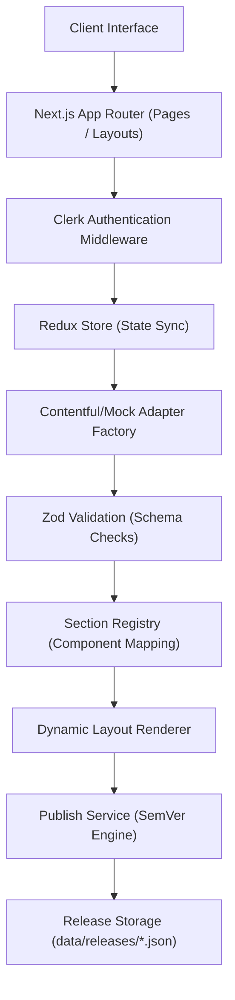

# LaunchPad Engineering Write-up

## 1. Problem Framing
LaunchPad addresses the challenges of visual content assembly, validation, and delivery. In modern web environments, visual page builders often suffer from a tight coupling to specific content management systems, poor schema validation, and uncontrolled versioning. 

LaunchPad solves these problems by providing a **decoupled, schema-driven, and highly accessible** drag-and-drop workspace. The primary goal is to empower content creators with real-time property modification, layout reordering, and version control, while ensuring that all generated content strictly adheres to pre-defined Zod schemas and WCAG 2.2 accessibility standards.

---

## 2. Key Decisions & Trade-offs

During development, several architectural choices were evaluated to balance performance, type safety, modularity, and security:

*   **Next.js App Router**: Chosen for its robust server-side rendering (SSR), static site generation (SSG) capabilities, and built-in API routing. It allows for seamless revalidation of paths on layout modifications, ensuring the client receives fresh server payloads.
*   **TypeScript**: Implemented across the codebase to guarantee strict static typing. It ensures compiler-level validation of page section structures and API response payloads.
*   **Clerk Authentication**: Integrated to handle secure authentication and session management. Since native custom role mapping requires Clerk Enterprise, roles are simulated client-side for E2E validation, allowing a clean demonstration of permission gates (Viewer, Editor, Publisher) without platform constraints.
*   **Redux Toolkit**: Utilized for client-side state management. It provides a single source of truth for complex workspace states (such as active panels, selected elements, and SemVer selections), decoupling React rendering loops from nested layout states.
*   **Contentful Adapter Pattern**: Decouples the application from a specific CMS provider. By using a factory interface (`CmsAdapter`), we can easily switch between Contentful (production API) and local file-system mocks (development).
*   **Schema-driven Rendering & Section Registry**: The layout engine uses a registry to dynamically map JSON section types to UI components. This allows for modularity; new section templates can be registered without modifying the core renderer.
*   **Zod Validation**: Validates all incoming payloads at runtime (both client and server-side). Malformed layouts are safely blocked from persisting.
*   **Tailwind CSS (v4) & shadcn/ui**: Used to construct a premium, consistent visual identity. Tailwind CSS provides tokenized styling, while shadcn/ui provides access-compliant, unstyled primitive components.

---

## 3. Assumptions

The design of LaunchPad relies on the following operational assumptions:
*   **Contentful Structure**: The space configuration in Contentful contains a content type matching the `PageSection` schema, allowing mapped delivery of layout blocks.
*   **Authentication & Session Life Cycle**: Users are authenticated via Clerk. E2E tests in public CI pipelines use mock keys, assuming that unauthenticated API routes are evaluated for `401` gating, while UI tests are skipped when live keys are unavailable.
*   **Release & Draft Persistence**: In local and CI environments, drafts and releases are stored as JSON files under the `data/` (or `/tmp/data` on Vercel) directory. In production (where real Clerk credentials are set), drafts and releases are persisted to **Clerk User/Organization Metadata** (`unsafeMetadata` / `publicMetadata`), guaranteeing cross-container serverless state sync out-of-the-box.
*   **User Roles**: Access privileges (Viewer, Editor, Publisher) are verified using mock metadata or simulated session roles during development.

---

## 4. What is Not Included and Why

*   **Live Contentful Content Management API (CMA) Writes**: The Contentful adapter is read-only (`getPage` / `listPages`). Saving drafts or publishing releases writes layout configurations to Clerk metadata (or local files) instead of executing CMA write actions. This trade-off simplifies token management and prevents concurrent editor overwrite conflicts.
*   **Clerk Enterprise RBAC Custom Roles**: Standard Clerk development instances do not support custom roles natively. We simulated Editor/Publisher permissions at the route handler level via custom logic and mock session metadata.
*   **Traditional Standalone Database**: A standalone database engine (like PostgreSQL) is omitted. Instead, we use Clerk's user/organization metadata as our lightweight, cloud-synchronized JSON store, which avoids database connection pooling issues and environment-specific database setup overhead.

---

## 5. Architecture Overview

The system architecture flows from the user interface down to persistence, executing authorization checks and data transformations sequentially:

### Data Flow Description:
1. **Interaction**: The user reorders sections or edits properties, updating the client-side **Redux Store**.
2. **Persistence Request**: Saving a draft or publishing triggers an HTTP request through Next.js **App Router API Routes**.
3. **Authentication**: The **Clerk Auth Middleware** validates the session token and user role.
4. **Adapter Factory**: The **CmsAdapter Factory** routes the call. If Contentful keys are absent, it targets the **Mock Adapter**.
5. **Schema Validation**: The payload is parsed using **Zod Validation** schemas to verify integrity.
6. **Publish Engine**: Publishing triggers the **Publish Service**, incrementing version tags via semantic versioning and saving the payload as an immutable snapshot in **Release Storage**.

---

## 6. Redux Slice Responsibilities

### `draftPage`
Handles editing and structural mutations of the page layout.
- **Editable Page**: Synchronizes page metadata (title, slug, status).
- **Section Reordering**: Performs array-index updates when `@dnd-kit` completes a drag-and-drop sort.
- **Property Updates**: Merges form mutations (e.g. CTA text changes) into the target section's state.

### `ui`
Manages visual panel toggles and selection overlays.
- **Dialogs & Overlays**: Tracks modal displays (e.g., publish configuration forms).
- **Selected Section**: Holds the ID of the actively edited section to populate the properties panel.
- **Saving States**: Dispatches loading indicators (`isSaving`) during network activity.

### `publish`
Manages the SemVer state.
- **Versioning**: Holds the SemVer bump selection (`patch`, `minor`, `major`) and notes.
- **Publish Status**: Handles loading flags and displays publishing history logs.

---

## 7. Contentful Model & Adapter

### Adapter Pattern
The `CmsAdapter` interface abstracts all database operations. The core application calls standard functions (`getPage`, `listPages`) without knowledge of whether it is communicating with Contentful's CDN or the local mock storage.

### Draft vs. Published Mode
- **Draft Mode**: Retrieves layout structures dynamically. In Contentful, it accesses the Preview API (`preview.contentful.com`). Locally, it loads the current state from `data/drafts/`.
- **Published Mode**: Pulls immutable snapshots. In Contentful, it uses the Delivery API (`cdn.contentful.com`). Locally, it pulls from `data/releases/`.

### Isolation Benefits
Isolating Contentful SDK configurations inside the adapter separates data fetching from visual UI components, enabling simple database migrations and making testing mock-friendly.

---

## 8. Publish & Semantic Versioning

LaunchPad enforces formal semantic versioning (SemVer) during release actions:
*   **Patch**: Increments the third digit (`0.0.x`) for minor text or alignment fixes.
*   **Minor**: Increments the second digit (`0.x.0`) for structural section modifications (e.g., adding a section).
*   **Major**: Increments the first digit (`x.0.0`) for breaking layout changes.

### Core Release Features:
- **Deterministic Diff & Idempotency**: If the active draft layout matches the latest release sections JSON string, the publish request returns the existing release without creating a duplicate.
- **Immutable Snapshots**: Page layouts are saved as immutable JSON configurations. Once published, the snapshot cannot be modified.
- **Changelog Generation**: Release notes and author credentials (pulled from Clerk metadata) are persisted alongside the version snapshot to build a transparent, automated audit trail.

---

## 9. Accessibility Approach

LaunchPad is designed to comply with WCAG 2.2 AAA-oriented requirements:
*   **Keyboard Navigation**: Drag-and-drop elements are fully keyboard accessible; users can focus, grab, sort, and drop layout sections using only the Tab and Arrow/Space keys.
*   **Focus Indicators**: Visible focus indicators (`focus-visible:ring-2`) are applied universally to all links, buttons, and input fields.
*   **Semantic HTML**: Layout outputs use appropriate semantic tags (`<section>`, `<article>`, `<header>`, `<footer>`).
*   **Accessible Forms**: Property editor forms use explicit labels, screen-reader friendly descriptions, and clear validation messages.
*   **prefers-reduced-motion**: Tailwind transitions and `@dnd-kit` animation frames are disabled dynamically if the user's OS preference suppresses motion.
*   **Playwright + Axe Testing**: Automated Axe accessibility audits (`@axe-core/playwright`) are run in the E2E test suite to guarantee zero detectable violations.
